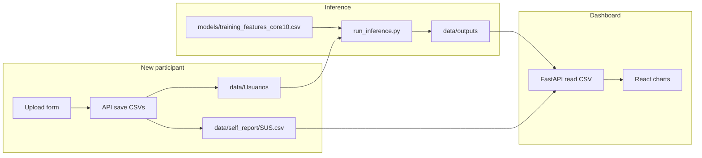

# Architecture

## Components

### Frontend (`apps/web`)

- **Stack:** React 18, TypeScript, Vite, Tailwind, Recharts  
- **Routes:** `/` cohort & results, `/upload` new participant  
- **Language:** English (UI and API field names)

### Backend (`apps/api`)

- **Stack:** FastAPI, Pydantic Settings  
- **Endpoints:**
  - `GET /api/v1/ux-uv/cohort-summary` — demographics & SUS distribution  
  - `GET /api/v1/ux-uv/research-summary` — stress/load cohort charts  
  - `GET /api/v1/ux-uv/subjects` — participant grid U01–U10  
  - `GET /api/v1/ux-uv/subject/{id}` — modal detail  
  - `POST /api/v1/projects/mexihc/participants` — save SUS + signals, run pipeline  

No database is required; persistence is file-based under `data/`.

### Pipeline (`pipeline/`)

| Script | Role |
|--------|------|
| `ux_uv_dataset.py` | Align UN markers to EA timestamps; label Basal / Task 1–3 |
| `database_features.py` | 60 s sliding windows → ten features |
| `run_inference.py` | Train SVM/GB on external CSV; score UX windows; write deltas |
| `join_sus_activation.py` | Merge SUS with activation summary |

Environment variables:

- `RESEARCH_DATA_ROOT` — defaults to `data/` under repo root  
- `TRAINING_FEATURES_CSV` — path to training feature matrix  

## Data flow

## Design choices

1. **File-based storage** — simple replication with Zenodo drop-in folders.  
2. **Retrain on each inference run** — matches research pipeline; future work could ship frozen `.joblib` models.  
3. **Separate training corpus** — the public Git repo stays free of the external training matrix used to fit stress/load models.  
4. **English API** — stable field names for papers and third-party tools.

See also `docs/DATA_CONTRACT.md` for CSV expectations.
